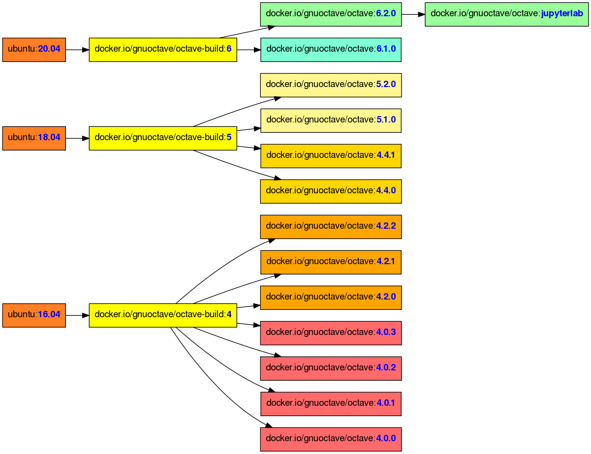
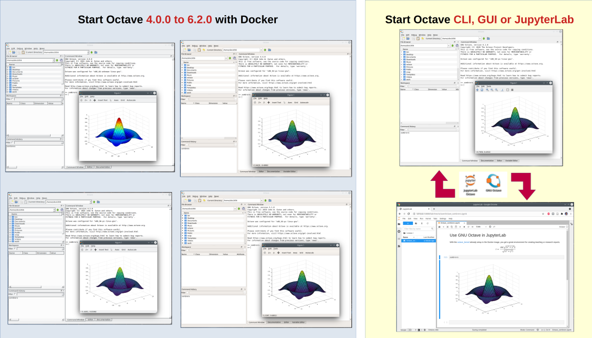
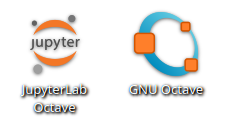
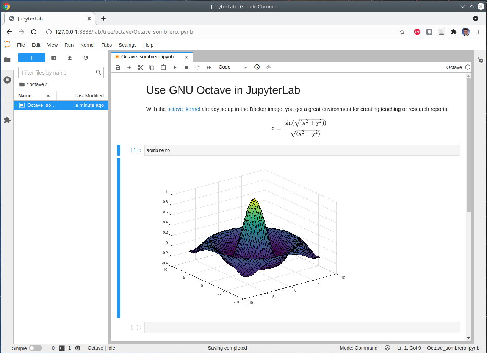
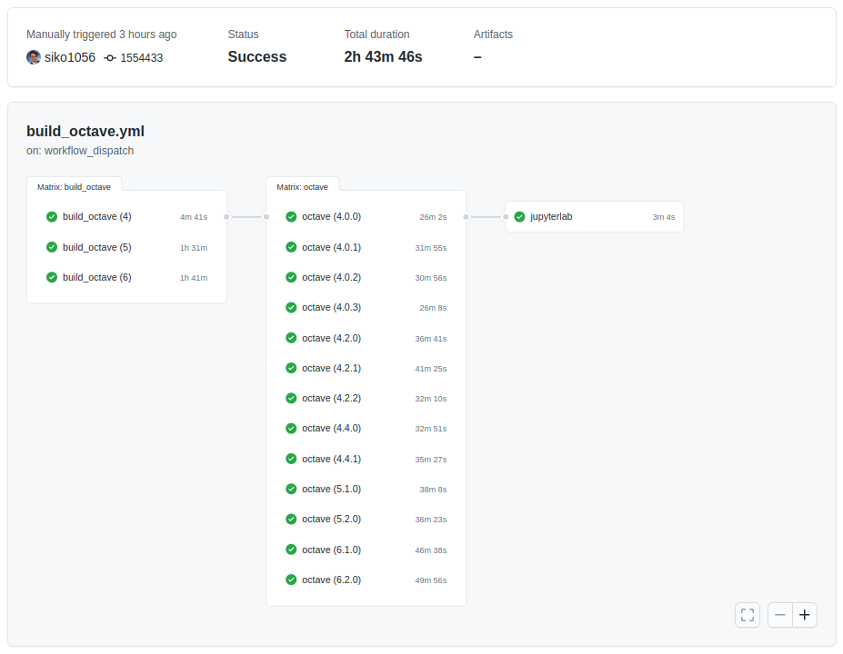

# Bring your own Octave

> Created: 2021-06-10

Thanks to the efforts of many developers,
[GNU Octave](https://octave.org) can be installed on all commonly used
Linux distributions today.
If the native distribution Octave package is out of date,
[Flatpak, snap, and others](https://wiki.octave.org/Octave_for_GNU/Linux#Distribution_independent)
jump in the gab.
Even though the latter systems keep on improving,
in the end they are distributed versions,
designed to be useful to many users and often difficult to customize.
This article describes another distribution independent Octave version,
based on
[Docker/Podman/Singularity](https://wiki.octave.org/Octave_for_GNU/Linux#Distribution_independent)
images,
which can be customized and shared with others.
Moreover,
it can use [JupyterLab](./octave_jupyterlab.png) as alternative "GUI" for Octave.


## What is this project about?

The <https://github.com/gnu-octave/docker> repository defines Docker images
- to build Octave
  (e.g. [`build-octave-6.docker`](https://github.com/gnu-octave/docker/blob/c4b868f47648e49dd882df8c40912e3781a16909/build-octave-6.docker)),
- to run a certain Octave release
  (e.g. [`octave-6.docker`](https://github.com/gnu-octave/docker/blob/c4b868f47648e49dd882df8c40912e3781a16909/octave-6.docker)), and
- to run software on top of Octave
  (e.g. [JupyterLab](https://github.com/gnu-octave/docker/tree/c4b868f47648e49dd882df8c40912e3781a16909/jupyterlab)).

Those Docker images are rebuilt monthly
to incorporate maintenance and security updates
and distributed via DockerHub:
- <https://hub.docker.com/r/gnuoctave/octave>
- <https://hub.docker.com/r/gnuoctave/octave-build>

The images can be used by [Docker](https://www.docker.com/)
(= [Podman](https://podman.io/))
and [Singularity](https://sylabs.io/singularity/).
In the end of this article,
some recommendations and experiences regarding the tools are given.

The following figure summarizes the available Octave Docker images
and their dependencies.

[](./docker_image_hierachy.png)


## What makes this project different?

The Octave Docker images are created with several usage scenarios in mind.

[](./octave_docker_overview.png)

- **Simple usage by (non-root) users**

  An installation script is provided,
  that can be called directly with this shell command:
  ```bash
  ## Install
  /bin/bash -c "$(curl -fsSL https://raw.githubusercontent.com/gnu-octave/docker/main/install.sh)" install -t singularity

  ## Uninstall
  /bin/bash -c "$(curl -fsSL https://raw.githubusercontent.com/gnu-octave/docker/main/install.sh)" install -u -t singularity
  ```
  It creates links in `$HOME/bin`,
  as well as Desktop entries,
  to start the Octave **and JupyterLab**
  as if it was installed by the Linux distribution.

  [](./octave_launcher.png)

  [](./octave_jupyterlab.png)

  **Note:** The system must have either Docker (= Podman) or Singularity
  installed and the user account must be setup to use those tools properly.
  Please adapt the shell command after `-t` respectively.

- **"Time travels"** (Docker only)

  Octave (package) developers,
  who want to test a specific Octave version X >= 4.0.0 (CLI or GUI)
  can pull the desired Docker image
  and don't have to worry about incompatible libraries
  or overlapping installations.

  > **Hint:** Using the installation script (described above),
  > the desired version can be started very conveniently
  >
  > - [`OCTAVE_VERSION=4.0.0 octave --force-gui`](./Octave_4.0.0.png)
  > - [`OCTAVE_VERSION=4.2.0 octave --force-gui`](./Octave_4.2.0.png)
  > - [`OCTAVE_VERSION=4.4.0 octave --gui`](./Octave_4.4.0.png)
  > - [`OCTAVE_VERSION=5.1.0 octave --gui`](./Octave_5.1.0.png)
  > - [`OCTAVE_VERSION=6.1.0 octave --gui`](./Octave_6.1.0.png)

  Please note that storing all those Octave version images is expensive.
  Therefore it is recommend to use **Docker** (Podman) for this task.
  In contrast to Singularity,
  Docker does not bundle all image layers into a single file.
  Image layers shared between images (e.g. Octave 4.0.0 and 4.0.1)
  do not have to be stored twice.

  After pulling all images:
  ```
  $ docker images
  REPOSITORY         TAG          IMAGE ID      ...  SIZE
  gnuoctave/octave   jupyterlab   c3f33109a9df  ...  3.81GB
  gnuoctave/octave   6.2.0        dc589b215991  ...  3.48GB
  gnuoctave/octave   6.1.0        635b3b411836  ...  3.47GB
  gnuoctave/octave   4.2.1        889f5cf8bbb9  ...  2.34GB
  gnuoctave/octave   5.1.0        56d1f94f3260  ...  2.83GB
  gnuoctave/octave   4.2.0        21e4bc9e07c0  ...  2.34GB
  gnuoctave/octave   5.2.0        8008f6c20bbe  ...  2.83GB
  gnuoctave/octave   4.4.1        dddef7f82523  ...  2.82GB
  gnuoctave/octave   4.2.2        c21b8daf6a96  ...  2.34GB
  gnuoctave/octave   4.4.0        ecf795465a96  ...  2.82GB
  gnuoctave/octave   4.0.1        aad035508ad4  ...  2.33GB
  gnuoctave/octave   4.0.2        9752ba4f54a9  ...  2.32GB
  gnuoctave/octave   4.0.3        df6af0aee010  ...  2.32GB
  gnuoctave/octave   4.0.0        d89e88593166  ...  2.33GB
  ```
  Summing up their sizes gives **38.38 GB**.
  But thanks to shared layers
  ```
  $ docker system df
  TYPE     TOTAL  ...  SIZE      RECLAIMABLE
  Images   14     ...  15.06GB   15.06GB (100%)
  ```
  the real storage requirement is only **15.06 GB (39 %)**.

- **CI projects**

  Automated Continuous Integration (CI) for software testing
  is becoming popular these days.
  For example the [Octave Packages](https://github.com/gnu-octave/packages)
  index uses the latest stable Octave image with
  [GitHub Actions](https://github.com/gnu-octave/packages/blob/ef2ee4290d64c087183b454db5e8f003857741f7/.github/workflows/main.yml#L62-L79)
  to perform basic package checks.


## Customizing the images or "your own Octave"

> **Off-topic note**
>
> When starting this blog post,
> [unfortunate news](https://www.docker.com/blog/changes-to-docker-hub-autobuilds/)
> regarding the shutdown of the "free" DockerHub Autobuild service
> were published.
>
> It took lots of time to get the Autobuild setup right
> and it was planned to advertise it in this blog post as "the way"
> to customize and publish Octave images.
> Many thanks to the DockerHub maintainers for their great service.
> It is a shame that free services are being misused.

If the choice of bundled software or configurations is not satisfactory,
there are options for customization:

### Adding a missing software (library)

The easiest task is to add to the existing Octave Docker images.
This can be done by a `Dockerfile`:
```bash
FROM  gnuoctave/octave:6.2.0
LABEL maintainer="Your Name <e@mail.com>"

# If a privileged installation is necessary
USER root

# Install a missing Ubuntu package
RUN apt-get --yes update  && \
    DEBIAN_FRONTEND="noninteractive" \
    apt-get --no-install-recommends --yes install \
      missing-ubuntu-package

# Install a custom library (Note: GLPK is already installed!)
RUN GLPK_VERSION=5.0     && \
    mkdir -p /tmp/build  && \
    cd       /tmp/build  && \
    wget -q "https://ftp.gnu.org/gnu/glpk/glpk-${GLPK_VERSION}.tar.gz"  && \
    tar -xf glpk-${GLPK_VERSION}.tar.gz  && \
    cd      glpk-${GLPK_VERSION}         && \
    ./configure             \
      --with-gmp            \
      --prefix=/usr         \
      --libdir=/usr/lib  && \
    make -j8             && \
    make check           && \
    make install         && \
    rm -rf /tmp/build

# Ensure starting with an unprivileged default user.
USER jovyan
```
Finally the customized Octave Docker image can be build locally with the
[`docker build`-command](https://docs.docker.com/engine/reference/commandline/build/)
or by using an automated build service like
[GitHub Actions](https://github.com/gnu-octave/docker/blob/155443345ab77e93e186e0c251ac442870aaba70/.github/workflows/build_octave.yml).

For example,
building **all** provided Octave images using GitHub Actions
takes about three hours.
As one can see in the next figure,
extending existing images is much faster
(the JupyterLab extensions takes just 3 minutes to build),
as most of the "hard" work is already done.

[](./github_actions.png)

### Customizing existing images

To change the existing Octave Docker images,
it is recommended to copy the `Dockerfile`(s) of interest,
to modify and build them (locally or by an automated build service).

For Octave 6.2.0 + JupyterLab the `Dockerfile`(s) of interest are in the chain
[`build-octave-6.docker`](https://github.com/gnu-octave/docker/blob/c4b868f47648e49dd882df8c40912e3781a16909/build-octave-6.docker)
➡
[`octave-6.docker`](https://github.com/gnu-octave/docker/blob/c4b868f47648e49dd882df8c40912e3781a16909/octave-6.docker)
➡
[`jupyterlab/Dockerfile`](https://github.com/gnu-octave/docker/blob/c4b868f47648e49dd882df8c40912e3781a16909/jupyterlab/Dockerfile).

What is remarkable about this approach is
that uploading those customized images makes the installation as easy as
with the already provided Octave Docker base images of
<https://hub.docker.com/r/gnuoctave/octave>.
In particular,
there is no need to beg or convince distribution maintainers
to regard own desired customizations.


## Bad news for oldtimers (RHEL/CentOS 7)

Even though containers are great to become independent of the host system,
some elementary requirements remain,
such as the Linux kernel.
[RHEL/CentOS 7](https://en.wikipedia.org/wiki/CentOS) uses Linux 3.10
and is a dominant distribution in many companies and universities
until the end of life in June 2024.

All Docker images up to Octave 5 work on RHEL/CentOS 7 without problems.
In contrast,
Octave 6 images (and all newer Octave images in the future)
use Ubuntu 20.04 as base image.
The qt libraries of Ubuntu 20.04 are compiled using a Linux kernel feature,
[which is not given in Linux 3.10](https://code.qt.io/cgit/qt/qtbase.git/tree/src/corelib/global/minimum-linux_p.h?id=4d9ac14bf8d1c1a33a2720c7f7dcaf8d912a592f#n77),
and any attempts to start the GUI or print graphics will end with this
error message:
```
$ octave
/usr/libexec/octave/6.2.0/exec/x86_64-pc-linux-gnu/octave-gui: error while loading shared libraries: libQt5Core.so.5: cannot open shared object file: No such file or directory
```
If you only use the CLI version for computations and avoid graphics
(which is an unrealistic use case for a desktop installation of Octave),
you can sneak around this limitation.
```
$ octave-cli
GNU Octave, version 6.2.0
[...]
For information about changes from previous versions, type 'news'.

>>
```
As described in the last section,
you are free to customize and publish Docker images
building Octave 6 based upon the
[docker.io/gnuoctave/octave-build:5](https://hub.docker.com/r/gnuoctave/octave-build)
image.


## Summary

Another Linux distribution independent way to install and run GNU Octave
was introduced.
The approach offers new ways of using and sharing
customized Octave installations.

For the average user both, Docker and Singularity, perform equally well.
**Docker** is to favor,
when the intention is to install several Octave versions in parallel
(see "Time travels" above).
**Singularity** is clearly the choice for archiving or sharing images.
This is in particular interesting for research projects,
where all Octave setups should be at best equal and unaffected by updates
or system changes.
**Podman**,
despite all praises by RedHat,
had problems when running the Octave Docker images as non-root user.
For example dealing with the default internal container user "jovyan"
or the GPU and graphics support has still some flaws.

Finally, thanks to GitHub Actions and DockerHub,
maintaining the introduced infrastructure comes almost for free.
