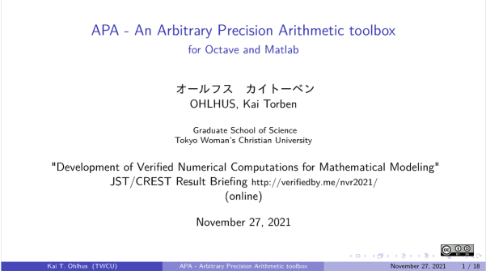

# Talk (online) at the JST/CREST meeting"

> Created: 2021-11-27

The [slides](https://github.com/siko1056/slides_nvr2021/blob/main/slides.pdf)
about the
[arbitrary precision arithmetic (APA) toolbox](https://github.com/gnu-octave/pkg-apa)
of my talk at the
"JST/CREST "Development of Verified Numerical Computations for Mathematical Modeling" Result Briefing"
<http://verifiedby.me/nvr2021/> (online).

The talk reviews existing GNU Octave/Matlab arbitrary precision arithmetic
toolboxes, summarizes the current development status of the APA toolbox
with usage examples, benchmarks, and an outlook for further extension.
